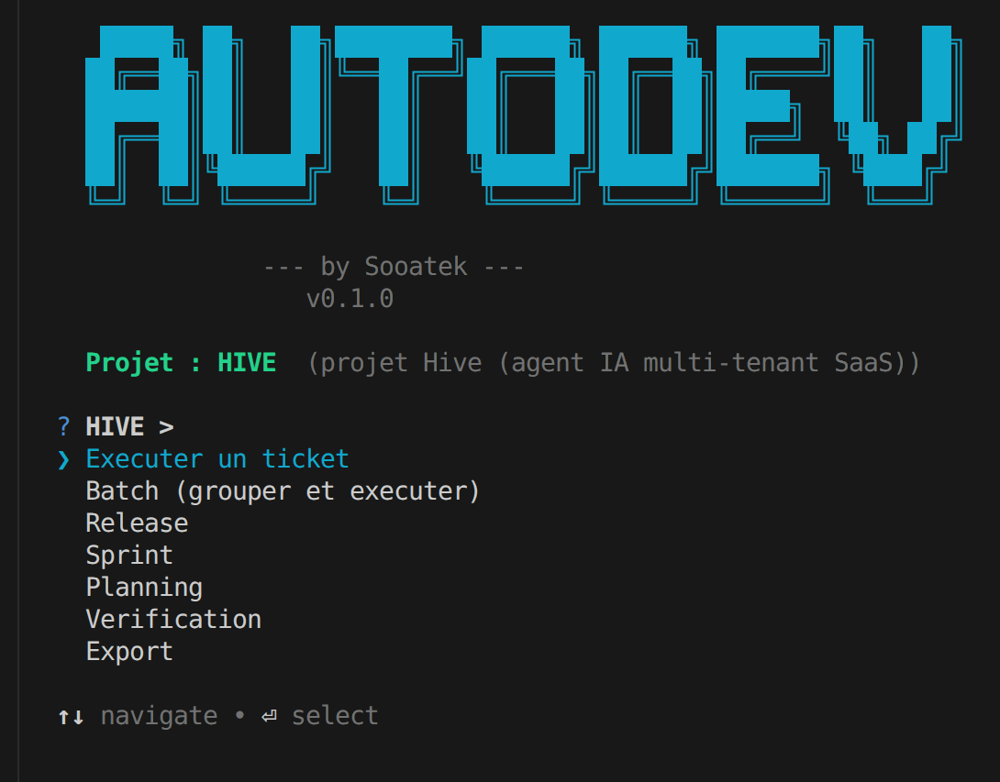

# AUTODEV

### by Sooatek — v0.1.0

**Un agent autonome qui transforme vos tickets Jira en code livré.**

Du plan d'implémentation au merge de la PR, AUTODEV orchestre l'intégralité du cycle de développement — sans intervention humaine sur les tâches d'exécution.



---

## Le problème

La gestion classique d'un projet de développement consomme une part disproportionnée du temps de l'équipe en tâches non-productives :

- **Coordination manuelle** — assigner les tickets, vérifier les dépendances, relancer les blocages
- **Context-switching** — passer de Jira au code, du code à GitHub, de GitHub à Confluence
- **Tickets oubliés** — des tâches stagnent "En cours" pendant des semaines sans que personne ne le détecte
- **Releases artisanales** — tagging, changelogs, fixVersions, pages Confluence, tout est fait à la main
- **Documentation décorrélée** — les rapports d'implémentation et les recaps de sprint arrivent en retard (ou jamais)
- **Pas de visibilité** — la vélocité et les anomalies ne sont découvertes qu'en rétrospective

---

## Ce qu'AUTODEV fait

AUTODEV prend le contrôle du cycle opérationnel d'un projet :

- **Exécute les tickets automatiquement** — récupère le prochain ticket non bloqué, crée la branche, code la solution via Claude Code, pousse la PR
- **Planifie à partir d'un document** — transforme un plan Markdown en sprints structurés et tickets Jira prêts à exécuter
- **Regroupe et exécute en batch** — identifie les tickets liés, les groupe intelligemment, une PR par groupe
- **Parallélise le travail** — traite plusieurs tickets simultanément via des git worktrees isolés
- **Gère les releases de bout en bout** — version Jira, tag Git, GitHub Release, changelog Confluence
- **Pilote le cycle de sprint** — fermeture, report des tickets restants, création du sprint suivant
- **Vérifie les livrables** — audit fonctionnel des tâches terminées, création automatique de tickets pour les anomalies
- **Mesure la performance** — vélocité par sprint, détection des tickets stagnants

---

## Workflow

Le pipeline complet, de l'idée au livrable :

```
                                    AUTODEV — Pipeline

  ┌──────────┐    ┌──────────┐    ┌──────────┐    ┌──────────┐    ┌──────────┐
  │  Plan.md │───▶│ Analyser │───▶│ Découper  │───▶│ Détailler│───▶│ Importer │
  │          │    │ le plan  │    │en sprints │    │les tâches│    │dans Jira │
  └──────────┘    └──────────┘    └──────────┘    └──────────┘    └──────────┘
                   Brainstorm      Grouper par      1 Claude        Sprints +
                   Questions       thème et         par sprint      Tickets +
                   Risques         dépendances      Story points    Liens
                                                    Dépendances
       │              │                │                │               │
       │              ▼                ▼                ▼               │
       │         Validation       Validation       Validation          │
       │          humaine          humaine          humaine            │
       │                                                               │
       └───────────────────── PLANNING ────────────────────────────────┘

                                    │
                                    ▼

  ┌──────────┐    ┌──────────┐    ┌──────────┐    ┌──────────┐    ┌──────────┐
  │  Ticket  │───▶│ Branche  │───▶│  Claude   │───▶│    PR    │───▶│  Merge   │
  │   Jira   │    │   Git    │    │   Code    │    │  GitHub  │    │ + Close  │
  └──────────┘    └──────────┘    └──────────┘    └──────────┘    └──────────┘
   Récupérer       Créer           Implémenter     Pousser          Merger la
   le prochain     feat/KEY-N      le ticket       et créer         PR, fermer
   non bloqué      depuis main     en autonome     la PR            le ticket

       │              │                │                │               │
       │              ▼                ▼                ▼               │
       │         Transition       Détection        Review auto         │
       │         "En cours"       BLOCKED.md       si configuré        │
       │                                                               │
       └───────────────────── EXÉCUTION ───────────────────────────────┘

                                    │
                                    ▼

  ┌──────────┐    ┌──────────┐    ┌──────────┐    ┌──────────┐
  │ Vérifier │───▶│ Release  │───▶│  Sprint  │───▶│Confluence│
  │les tâches│    │ v1.x.0   │    │  Close   │    │  Publish │
  └──────────┘    └──────────┘    └──────────┘    └──────────┘
   Audit            Tag Git +       Fermer le       Rapports
   fonctionnel      fixVersions     sprint,         implémentation
   des DONE         GitHub          créer le        + changelogs
   → bug tickets    Release         suivant

       └───────────────────── LIVRAISON ───────────────────────────────┘
```

Chaque phase intègre une **validation humaine** : AUTODEV propose, l'humain valide.

---

## Métriques — Classique vs AUTODEV

| Activité | Gestion classique | Avec AUTODEV | Gain |
|----------|-------------------|--------------|------|
| **Setup d'un ticket** (branche, contexte, env) | 10-15 min | 0 min (automatique) | ~100% |
| **Exécution d'un ticket standard** | 1-4h (dev humain) | 5-15 min (Claude Code) | 80-95% |
| **Coordination** (dépendances, statuts, relances) | 30 min/jour | 0 min (détection auto) | ~100% |
| **Création de PR** (description, lien ticket) | 5-10 min | 0 min (automatique) | ~100% |
| **Release** (tag, version, changelog, Confluence) | 30-60 min | 2 min (une commande) | ~95% |
| **Sprint close** (report tickets, créer suivant) | 15-30 min | 1 min (une commande) | ~95% |
| **Documentation** (recaps, rapports) | 30-60 min/sprint | 0 min (auto-généré) | ~100% |
| **Détection tickets stagnants** | Rétrospective (trop tard) | Temps réel (`--stale`) | Proactif |
| **Planification** (plan → tickets Jira) | 2-4h | 15-30 min (assisté par IA) | ~85% |
| **Vérification fonctionnelle** | Manuelle ou absente | Automatique (`--verify`) | Nouveau |

**En résumé :** pour un sprint de 10 tickets, AUTODEV économise entre **8 et 20 heures** de travail opérationnel — du temps redistribué vers la conception, la review et les décisions produit.

---

## Fonctionnalités

| Mode | Description | Commande |
|------|-------------|----------|
| **Ticket unique** | Exécuter un ticket spécifique | `autodev HIVE-42` |
| **Next** | Prendre le prochain ticket non bloqué | `autodev --next` |
| **Batch** | Grouper et exécuter les tickets liés ensemble | `autodev --batch` |
| **Parallèle** | Traiter N tickets simultanément (worktrees) | `autodev --next --parallel 3` |
| **Planning** | Plan.md → sprints → tâches → Jira | `autodev --plan docs/plan.md` |
| **Release** | Version Jira + tag Git + GitHub Release | `autodev --release "v1.0.0"` |
| **Sprint close** | Fermer le sprint, créer le suivant | `autodev --close-sprint` |
| **Vérification** | Audit fonctionnel des tâches terminées | `autodev --verify` |
| **Export** | Exporter les tâches done en Markdown | `autodev --export-done` |
| **Vélocité** | Métriques de performance par sprint | `autodev --velocity` |
| **Stale** | Détecter les tickets qui stagnent | `autodev --stale` |
| **Dry-run** | Prévisualiser sans exécuter | `autodev --dry-run HIVE-42` |
| **Interactif** | Menu guidé (aucun argument) | `autodev` |

Tous les modes supportent `--dry-run` pour prévisualiser sans effet de bord.

---

## Stack

| Composant | Rôle |
|-----------|------|
| **Node.js 22+** | Runtime |
| **Claude Code CLI** | Agent d'exécution (implémentation des tickets) |
| **Jira Cloud API v3** | Source de vérité (tickets, sprints, versions) |
| **GitHub CLI (`gh`)** | Gestion des PR et releases |
| **Confluence API v2** | Publication des rapports et changelogs |

Zéro framework, dépendances minimales (`commander` + `dotenv`). Un fichier de config JSON par projet.
